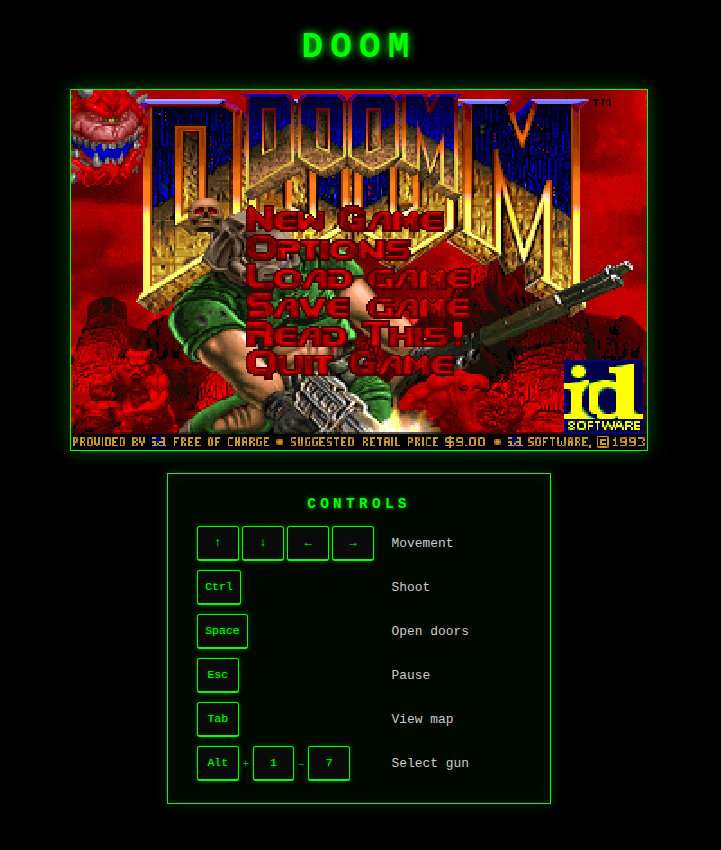

# DOOM Angular

DOOM running in the browser, built with Angular and WebAssembly.



## About

This is a personal project I built to practice my Angular skills in a fun way. It runs the original DOOM inside an Angular application, using WebAssembly to execute the game engine directly in the browser.

The Angular layer handles the UI, the canvas rendering, and the keyboard input, while the game itself is powered by `wasm-doom`.

## Requirements

- Node.js (LTS version)
- npm (comes with Node.js)

## Running locally

1. Clone the repository:

   ```bash
   git clone https://github.com/ruipachecoo/doom.git
   cd doom
   npm install
   ng serve
   ```
